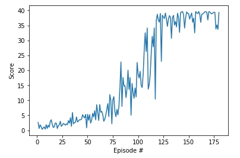

## Agent Implementation

### Deep Deterministic Policy Gradient (DDPG)

# Project 2: Continuous Control

For this project I decided to use a **Deep Deterministic Policy Gradient** (DDPG) implementation developed to solve the `Pendulum` OpenAI Gym environment, and then tried to improve it, introducing variations like multiagent training and gradient clipping. More info in the paper [Continuous control with deep reinforcement learning](https://arxiv.org/abs/1509.02971). 

## Learning Algorithm: DDPG

This algorithm screenshot is taken from the [DDPG algorithm from the Spinning Up website](https://spinningup.openai.com/en/latest/algorithms/ddpg.html)

The Deep Deterministic Policy Gradient algorithm is a particular actor-critic method, where the critic is a neural network used to estimate the action value function  Q(s,a) and the actor mu(a) is another neural network that outputs the action maximizing Q. Hence, the training process evolves alternating the following steps:   

- training the Q network, minimizing the temporal difference error, with the actor network parameters fixed.
- training the actor nework mu, maximizing Q(s,mu(s,a)), with the Q network parameter fixed.

The high affinity with the DQN algorithm allows to use also the following improvements:

- target networks: in order to avoid instability issues, the expected Q-value at the time step t+1 is calculated using a network which is frozen periodically; the same is used for the critic network.
- experience replay buffer: the learning steps are carried on by mini-batches backpropagations, after sampling randomly from a buffer of memory, in order to avoid that too much correlated transitions drive the process to overfitting; using a multiagent training, the experience of each agent is collected in the same buffer, in order to update the common networks.

The training step has been performed once per timestep, that is, once every 20 experiences, using the target network soft-update (θ_target = τ*θ_local + (1 - τ)*θ_target). This should improve the learning stability. For this purpose, I also used gradient clipping on the Q network gradients.

For exploration, I used the Ornstein-Uhlebeck noise, using a Gaussian sampling.

The actor neural network takes the state as input consists of 3 fully connected layers, with relu activations for the first 2 layers (hidden) and a tanh activation for the output (which in fact should be in the range (-1,1)).  
The actor neural network consists of 3 fully connected layers, with relu activations for the first 2 layers (hidden) and a linear activation for the output. The first input, the state, is taken by the fist layer, while the second one, the action, is taken by the second layer together with the output of the first one.

The reward history during training is shown in the following picture:

![DDPG_trained][image1]
 
that is also visible in the `Continuous_Control.ipynb` file together with a verbose logging of average rewards over the last 100 steps: it has taken 289 episodes to solve the problem, that is, in order to get an average reward greater than 30. The related weight files are `checkpoint_actor.pth` and `checkpoint_critic.pth`.

# Code implementation

The code is written in [Python 3.6](https://www.python.org/downloads/release/python-360/) and is relying on [PyTorch 0.4.0](https://pytorch.org/docs/0.4.0/) framework.

The code includes :

- `model.py` : Provide the **Actor** and the **Critic** classes.
    - The Actor and Critic classes BOTH implements a **Target** and a **Local** Neural Networks used for the training.
    
- `ddpg_agent.py` : Implement the **DDPG agent** and a **Replay Buffer memory** used by the DDPG agent.
    - The Actor's *Local* and *Target* neural networks, and the Critic's *Local* and *Target* neural networks are instanciated.
    - The `learn()` method updates the policy and value parameters using given batch of experience tuples.
  
- `Continuous Control Main.ipynb` : This Jupyter notebooks allows to instanciate and train the agent. More in details it allows to :
  1. Prepare the Unity environment and Import the necessary packages 
  2. Check the Unity environment
  3. Watch an untrained agent
  4. Train an agent using DDPG
  5. Plot the score results
  6. Watch an smart agent

# Methodology

As a starting point, the initial version of the DDPG agent used the parameters values described in the paper [Continuous control with deep reinforcement learning](https://arxiv.org/abs/1509.02971). 

To improve the performance in this task, I did:
- **Increasing the number of steps per episode.** (To 2000)
- **Reducing the Sigma values** used in the Ornstein-Uhlenbeck noise process was another important change for the agent to start learning
- **adding the batch normalization layer after the activation layer**
- **adjust the learning rates used** (to 2e-4)

# Results

## Possible improvements

The environment has been solved in a quite satisfactory fashion with the multiagent DDPG algorithm, nevertheless, for the future, I'd like to get a better understanding of the influence of some hyperparameters on the learning stability and speed, with particular attention on:   

- learning steps frequency
- batch size
- soft update rate

In addition, I'd like to evaluate a different exploration policy, like a variational approach on networks parameters, which should lead to a more consistent exploration.

Last but not least, I'd like to compare the performance of my improved DDPG with:

- PPO
- A3C
- D4PG

